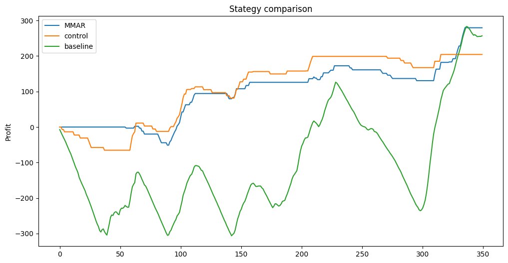

# Modeling Options Prices considering Mandelbrotian Movement of Prices
Capstone project for the MScFE course at [World Quant University](https://www.wqu.edu/programs/mscfe/) (February 2024)

Authors:
- [Andrea Dalseno](https://github.com/adalseno)
- [Vsevolod Cherepanov](https://github.com/VB00)
- [Sanchit Jain](https://github.com/sanchitjain333)

The repo structure follows this post: https://khuyentran1401.github.io/reproducible-data-science/structure_project/introduction.html

## Main directories with their use and content

    ├── data: data files
    │   ├── final
    │   ├── processed
    │   └── raw: Raw files are not included and must be downloaded from source
    │       
    ├── docs: Documentation for the MMAR class and utility functions
    │   
    ├── notebooks: the notebooks used in the project
    ├── src: source files. In some cases contains local copies of packages available on [Pypi](https://pypi.org/) for compatibility reasons.
    │   ├── MMAR: the MMAR class
    └── tests: test files (at present not used)

The main purpose of this project is to provide a simple class to allow building a [Multifractal Model of Asset Returns](https://users.math.yale.edu/~bbm3/web_pdfs/Cowles1164.pdf) based on actual data.

We used the class to compute the main parameters for the MMAR model and then used them to create a Monte Carlo simulation. We used the simulated data (based on SPY ETF) to improve option predictions using a basic trading strategy, which proved to be reasonably effective in out test-case:

* For S&P500 ETF (SPY) data, we used [Yahoo Finance.](https://finance.yahoo.com/quote/SPY?.tsrc=fin-srch) 
* For option chains data, we used [OptionsDX](https://www.optionsdx.com/).
* For interest rates, we used [FRED](https://fred.stlouisfed.org/series/TB3MS).
* [Alpha Avantage](https://www.alphavantage.co/documentation/) provides more granular data (not only daily but also intraday), but those data haven't been used in the final version.
* dot files, such as *.env*, are clearly not uploaded to GitHub. You must create them locally with your API keys.
* There are many notebooks in the experiments branch that were not included in the final version, but might be interesting to explore. However, that branch is serveral commit behind, so don't expect the notebooks to work without some manual fixes.
* A basic documentation for the MMAR class, built using [Sphinx](https://www.sphinx-doc.org/en/master/), is available on [GitHub Pages](https://adalseno.github.io/mmar/).
